# Amazon Workspaces Demo

## About

This guide helps you build an Amazon Workspaces demo environment, including the deployment and configuration of a new Active Directory Domain Forest (corp.example.com) with a two-way trust to an AWS Managed AD Directory.

After the environment is deployed to your AWS Account, you will be able to launch new Amazon Workspaces for users in the corp.example.com domain.

Deploy Time: 20-40 minutes.

## Requirements

* AWS Account
* [Remote Desktop Client](https://docs.microsoft.com/en-us/windows-server/remote/remote-desktop-services/clients/remote-desktop-clients)

## Architecture


## Getting Started

We recommend deploying this demo environment to the closest AWS Region where Workspaces is available, the latest list can be found [here](https://docs.aws.amazon.com/workspaces/latest/adminguide/azs-workspaces.html).

Create a [new Cloud9 Environment](https://console.aws.amazon.com/cloud9/home) in your preferred region from the list above.
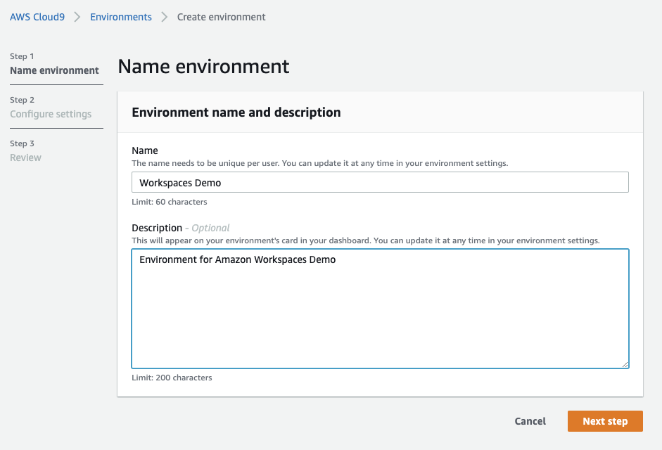

When configuring the Cloud9 environment, select the default options (Create a new EC2 instance with direct access, t2.micro, Amazon Linux 2)
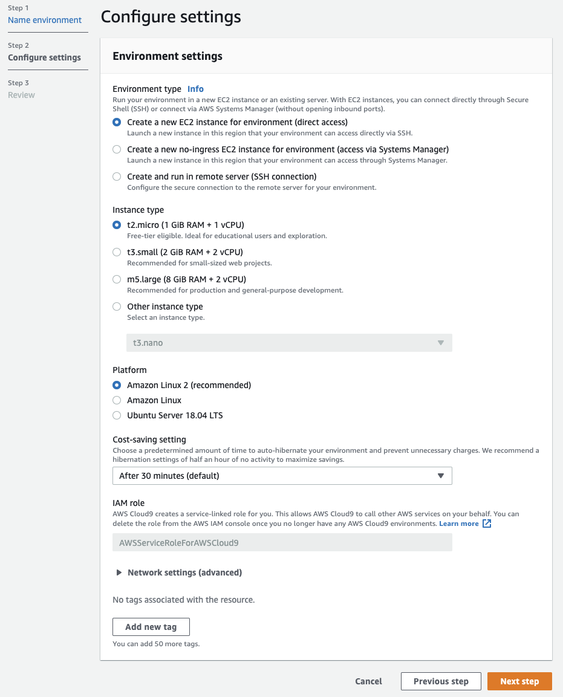

We will be using the Cloud9 terminal to deploy the demo resources, you can maximize the terminal window to have a larger view:
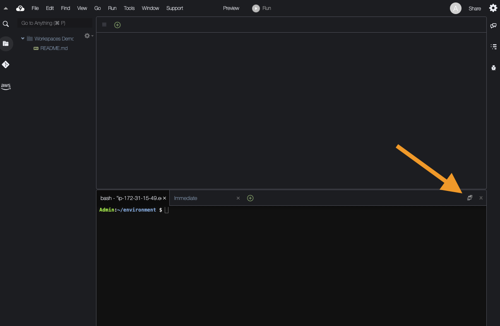

To start the deployment, execute the following command in your Cloud9 terminal:
```
bash <(curl -s https://raw.githubusercontent.com/aws-samples/amazon-workspaces-demo/main/deploy.sh)
```

The AWS::DirectoryService::MicrosoftAD deployment will take 30-40 minutes, **DO NOT close** the Cloud9 terminal during this time.

After the resources are created, you will need to provide your public IP address for the script to add a Security Group Rule for RDP access. You can view your current IP address from [https://checkip.amazonaws.com/](https://checkip.amazonaws.com/).

To create the trust from your corp.example.com to the aws-corp.example AWS Managed Directory download the RDP file from the EC2 console as instructed and login to the EC2 Domain Controller as Administrator with the secure password provided in the terminal. (You can also retrieve the password from Secrets Manager).

From the Windows Domain Controller, open Powershell CLI and create the DNS Conditional Forwarders with the command provided in the terminal, for example:
```
Add-DnsServerConditionalForwarderZone -Name aws-corp.example.com -MasterServers x.x.x.x,x.x.x.x -ReplicationScope Forest
```
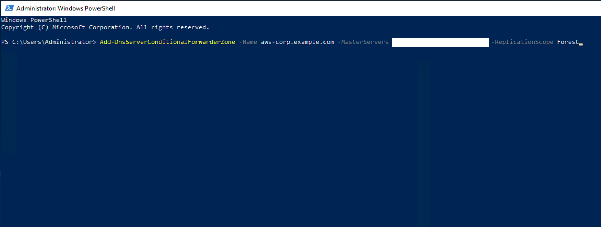

From the Windows Start Menu, open Active Directory Domains and Trusts:

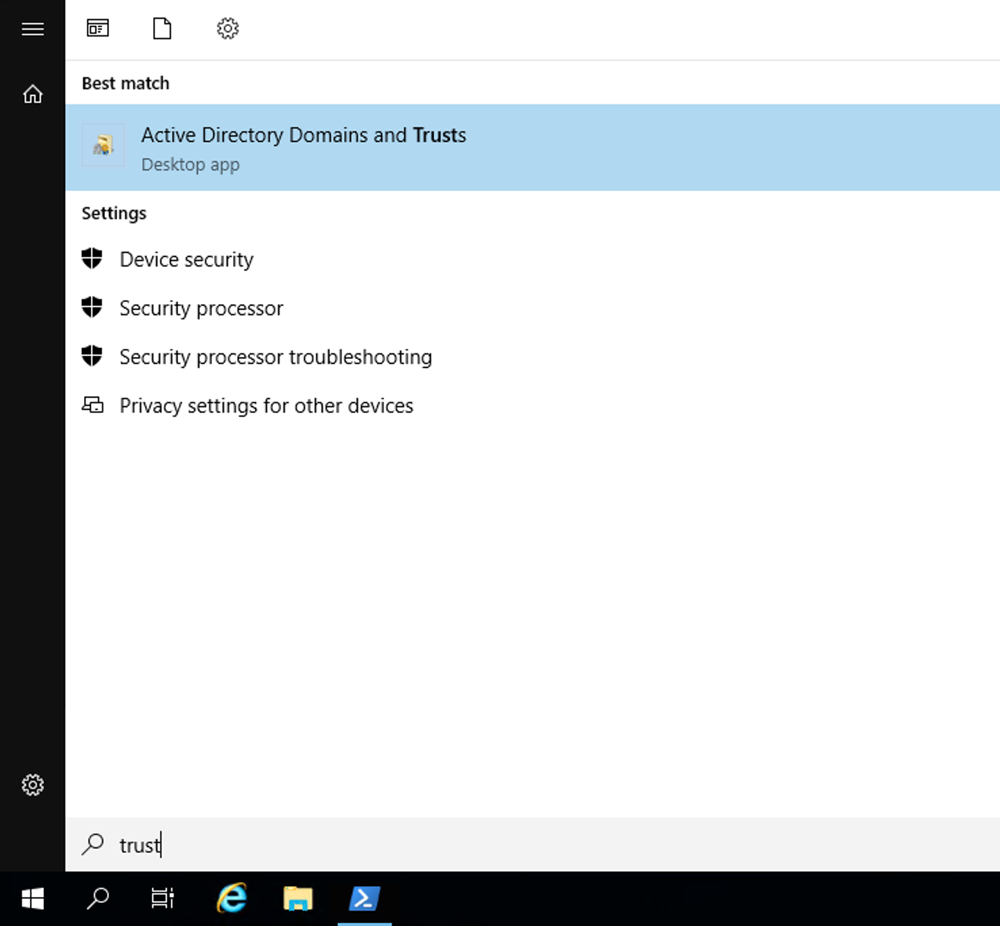

Right click over ```corp.example.com``` and select Properties:

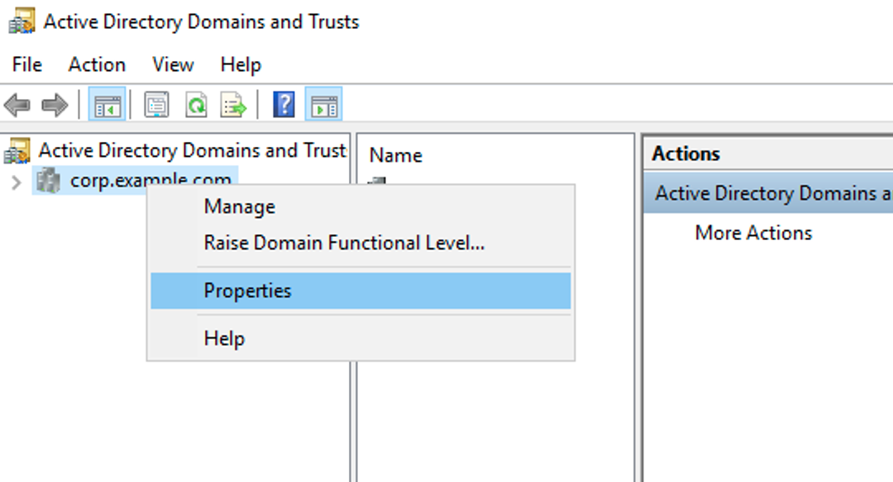

Click the Trusts tab and select New Trust:

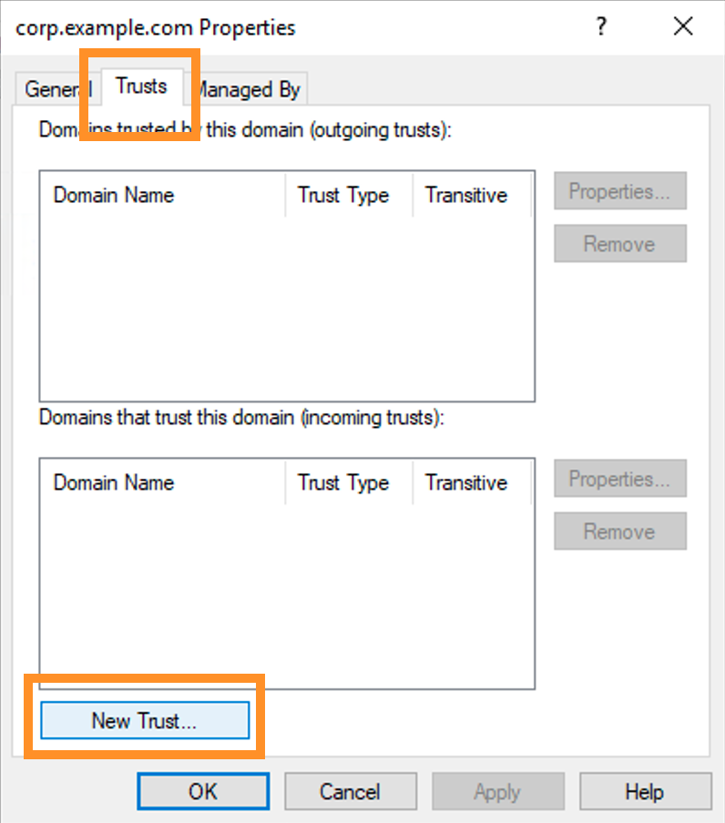

Click Next. For Trust Name enter ```aws-corp.example.com``` and click next.

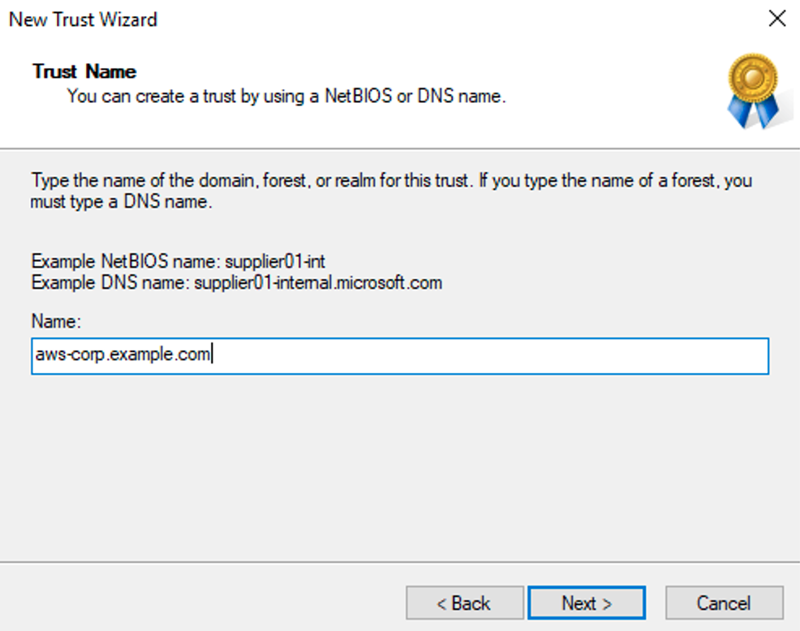

For Trust Type, select Forest Trust and click next.

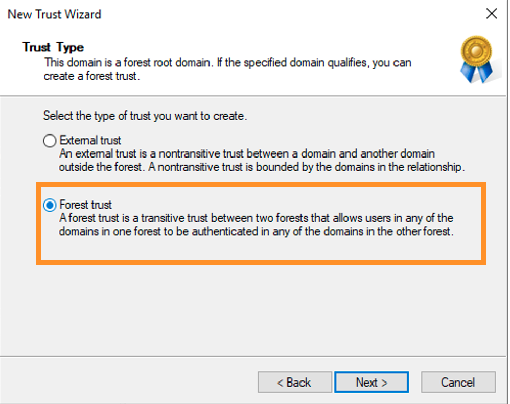

For Trust Direction, select Two-way and click next

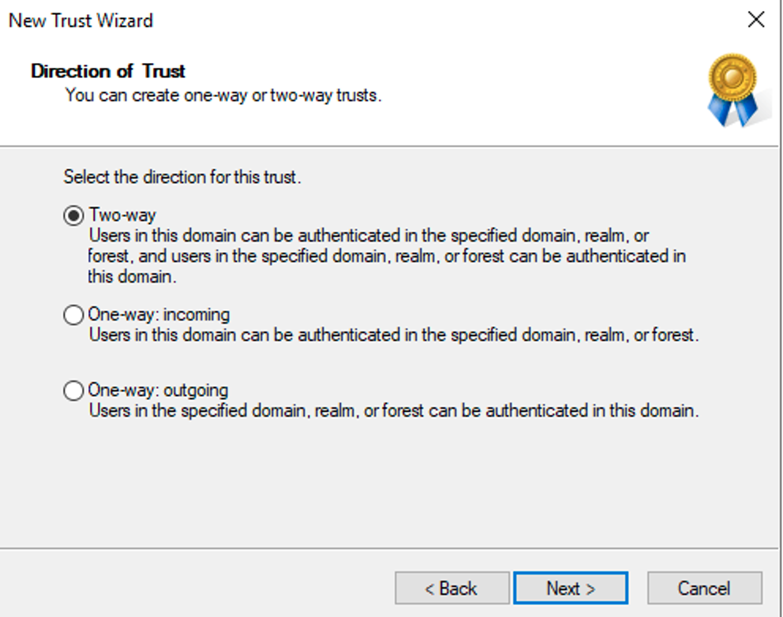

For the next wizard steps, keep the defaults and click next:


Enter a new password for the trust verification, you will need to provide this password back in the Cloud9 console:


Click next and keep all the defaults until you finish the wizard, the trust is now ready from the ```corp.example.com``` side, click OK:

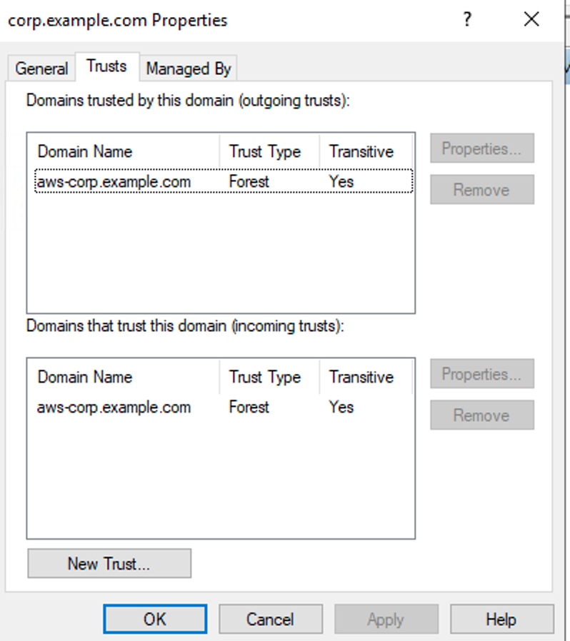

Go back to the Cloud9 Terminal and provide the password you entered in the Trust wizard.

The deployment is now completed! The trust verification takes about 10-15 minutes.

## Launching Workspaces for corp.example.com users

You can now create new user accounts in the corp.example Active Directory Domain and provision new workspaces. You can use Active Directory Users and Computers to create new users, or Powershell like this:

Open the Powershell CLI in the domain controller EC2 instance and run the following command (change the Email Address to yours to receive the Workspaces invitation email):

```
New-ADUser -Name "Carlos Salazar" -GivenName "Carlos" -Surname "Salazar" -SamAccountName "csalazar" -AccountPassword(Read-Host -AsSecureString "Input Password") -Enabled $true -EmailAddress youremail@example.com
```

Open the [Workspaces Console](https://console.aws.amazon.com/workspaces/home) and click Launch Workspaces:

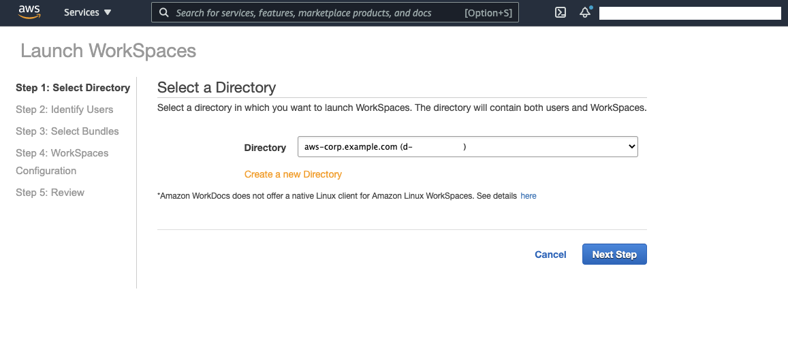

Select aws-corp.example.com and click Next Step

Select the corp.example.com Trust and click Show All Users

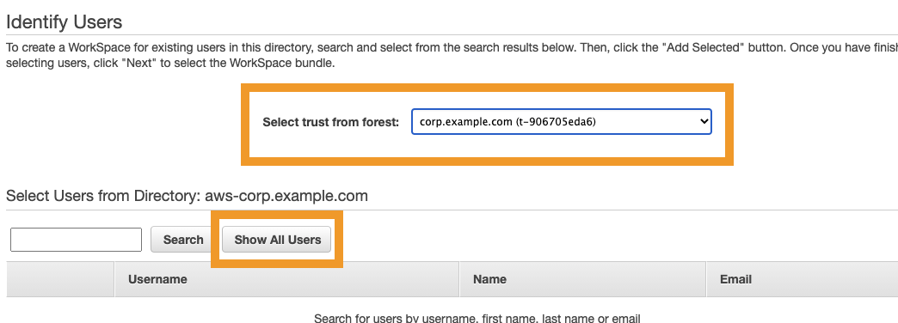

Select the user you created before, click Add Select and Next Step

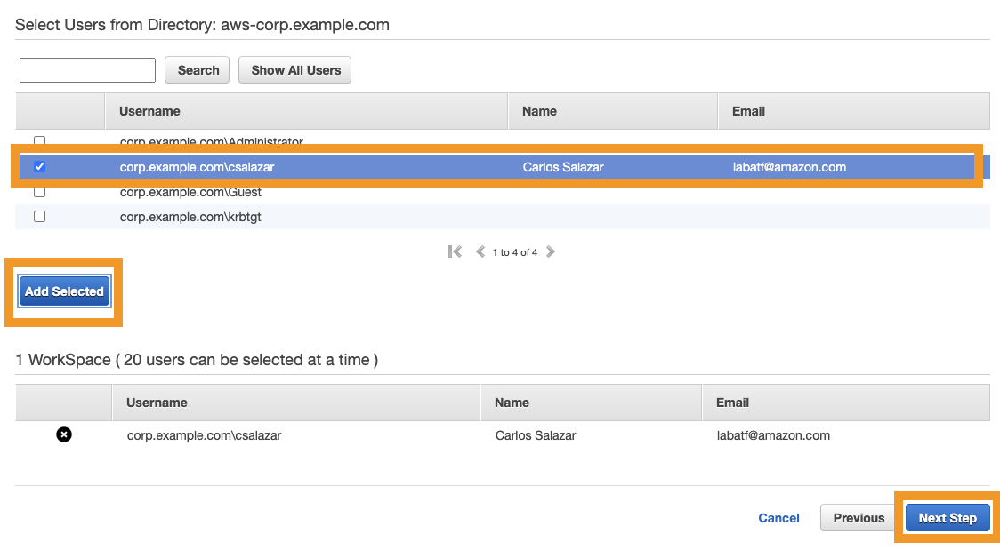

Select a bundle, click next and launch the Workspace.

## Security

See [CONTRIBUTING](CONTRIBUTING.md#security-issue-notifications) for more information.

## License

This library is licensed under the MIT-0 License. See the LICENSE file.

